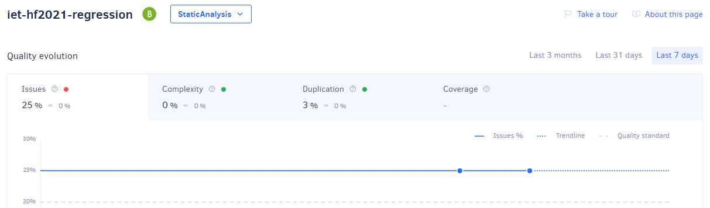
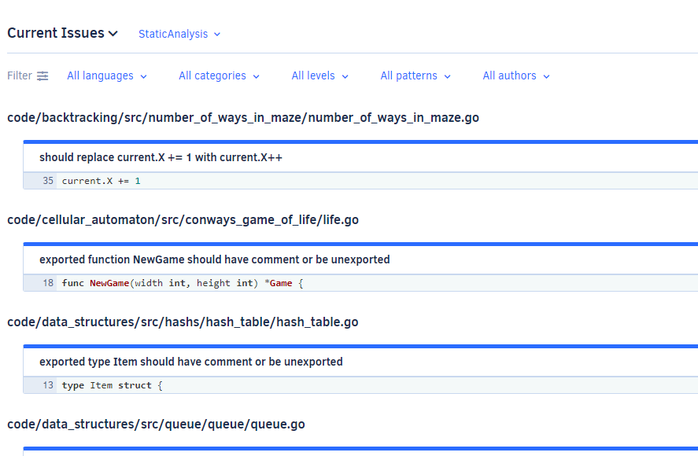
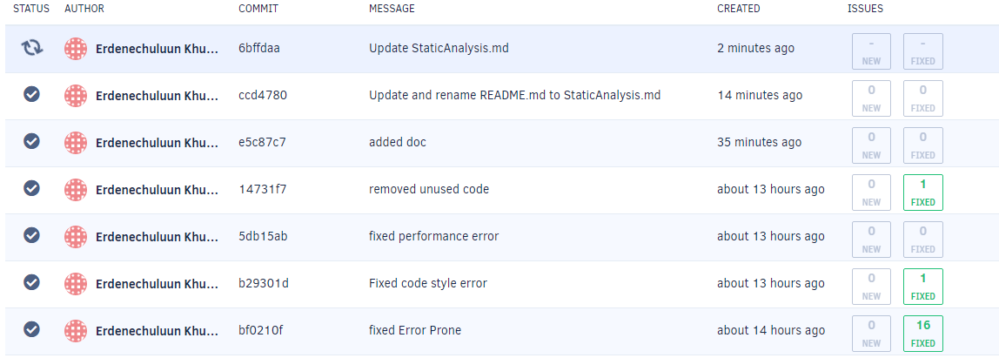
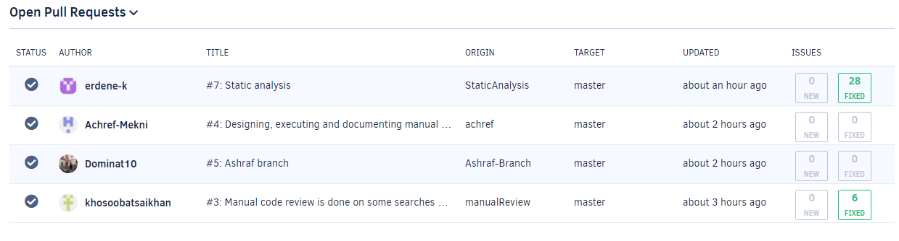

**Static analysis**

I used Codacy to run static analysis. It has many built-in tools like SonarC#, cppcheck, PMD, etc. 
We mainly reviewed Search and Sorting repository and fixed files that contains the most issues. Also, we fixed other various issues such as Error prone, Performance error,
Code style error and removed unused codes from other repositories.

*Dashboard*

*Issues*

*Fixed issue log*

*Pill request analysis*

