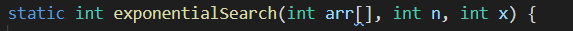
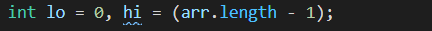
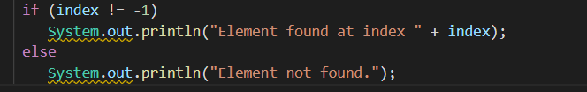
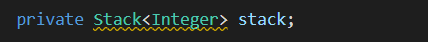
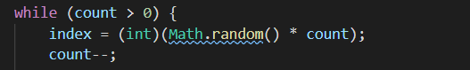
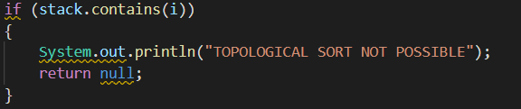
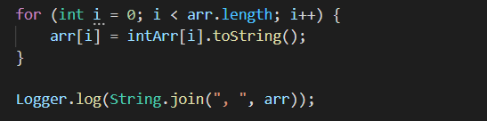

# Manual Code Review on Cosmos

## Preparation and review

As it is stated in Assignment documentation, we have focused on testing and reviewing Sort and Search algorthms of
cosmos. Before starting manual code review we have held a meeting as team and discuss how will conduct a review. As a
result, we have agreed to check ... Suggested changes to vulnerabilities will be reviewed by team and accepted changes
will be merged.

## Code review

### Clean code

1. Array designators were but located with the type of array but array itself. It is better for readability if we locate the array designator with type.

2. In interpolation_search.java, name of parameters used in function search() is not clear and parameter and its intentions are not commented.

3. Logging messages is better than writing it to console for debugging and knowing current state of application.

4. Source code of TopologicalSort and BogoSort is not properly commented with required information.

### Other

1. Used synchronization when asynchnous Deque can be used. Also, stack implments vector class as a result Stack is not LIFO structure because any elements at any position can be accessed. However in Deque, these operations are not possible.

2. Math.random() returns random double value and it is casted to integer. Instead of this, nextInt() which return pseudo-random integer should be used.

3. In topological_sort.java, null is returned from function, which have return type of int[], this may cause problem in the application,
   if input parameter can not be sorted. Instead of returning null, empty array or exception should be thrown.

4. In bogo_sort.java, output of current shuffle result is logged twice in main function and shuffle function, which is unnessary. Also, instead of logging numbers, it is casted to string and logged.

